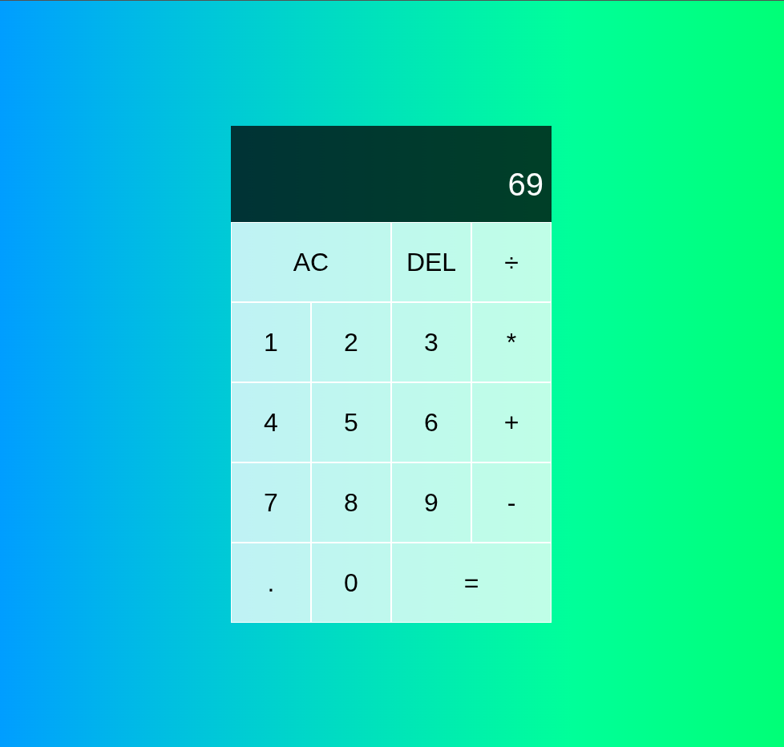
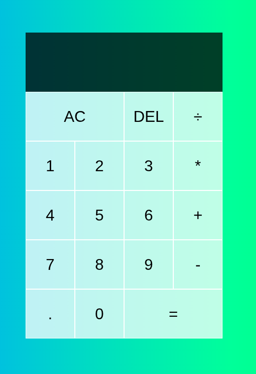

# Calculator

A simple calculator built with HTML, CSS, and JavaScript.

This project was created to practice front-end web development concepts such as HTML structure, CSS Grid layouts, DOM manipulation, event handling, and JavaScript classes. The calculator can perform basic arithmetic operations and provides a clean, responsive user interface.

## Features

* Addition, subtraction, multiplication, and division
* Decimal number support
* Delete last digit (DEL)
* Clear all input (AC)
* Real-time display updates
* Formatted number display
* Responsive calculator layout

## Technologies Used

* HTML
* CSS
* JavaScript

## Getting Started

1. Clone the repository:

git clone https://github.com/shulabhsapkota/Tic-Tac-Toe.git

2. Open the project folder.

3. Open `cal.html` in your browser.

No additional installation is required.

## Project Structure

├── cal.html
├── cal.css
└── cal.js

## Future Improvements

* Keyboard support
* Calculation history
* Scientific calculator functions
* Dark mode

  ## Screenshots

Here is the calculator interface:

And a demonstration of the calculations:

  
